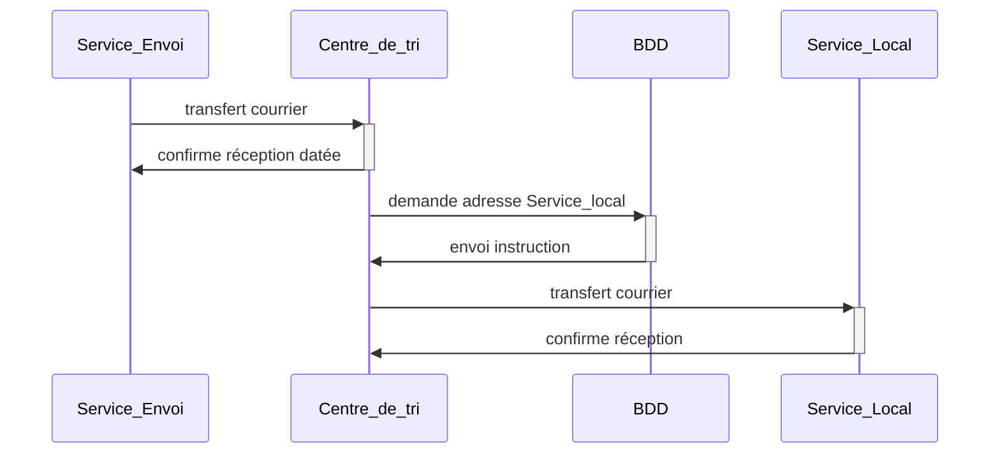
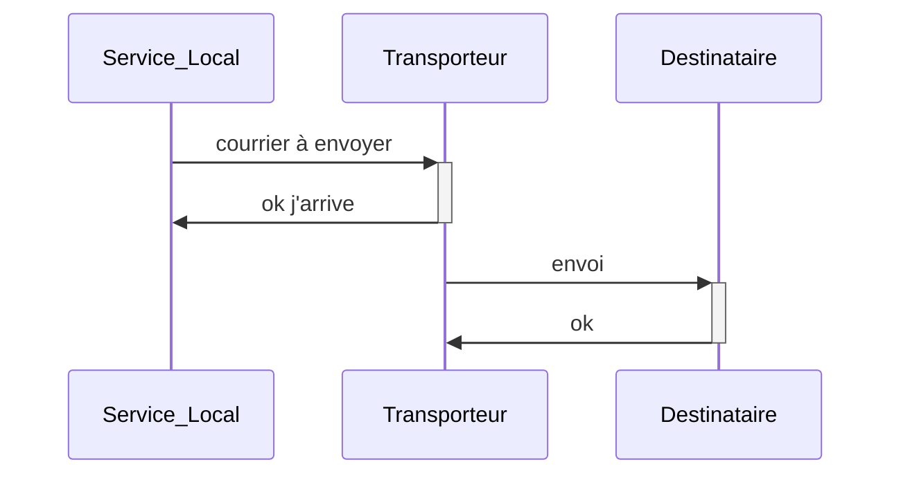

Ordre : 
USE CASES
DIAGRAMME DE SEQUENCES
MCD
BDD
REQUETES

Outils de diagramme :
plant uml : use case
mermaid live : diagramme séquence
db diagram.io : mcd

mcd = fusion de tous les diagrammes de séquences

Afficher diagrammes de séquences sur VSCode :

PGADMIN :
Depuis bddiagram.io > export en sql > ouvrir dans VSCODE
Depuis PGAdmin > create database > Querytool 

### Jointures ###
Left / Right / Inner

FROM table1, table2
WHERE table1.champs = table2.champs
AND condition
AND condition
...
 
